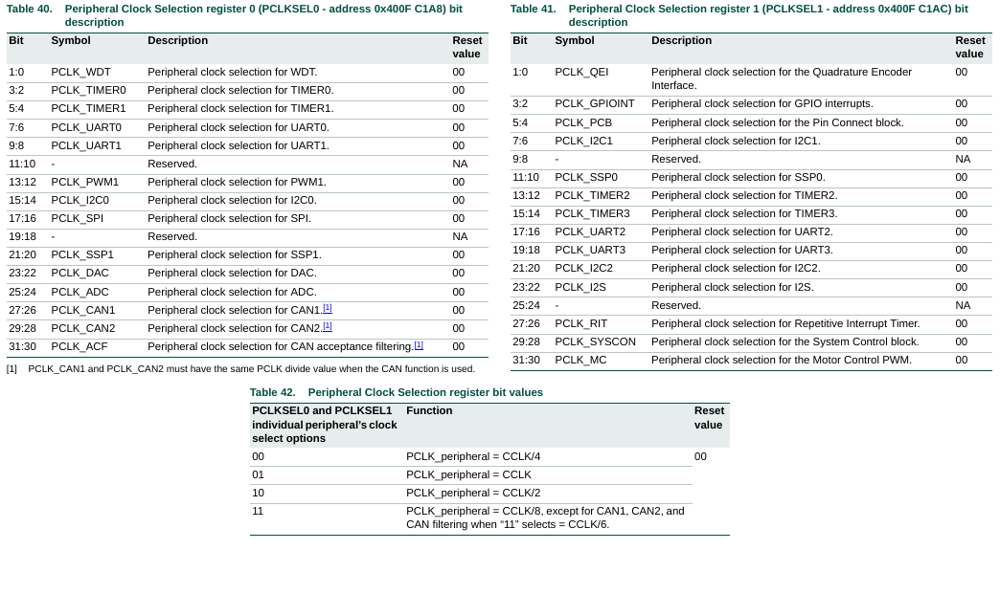
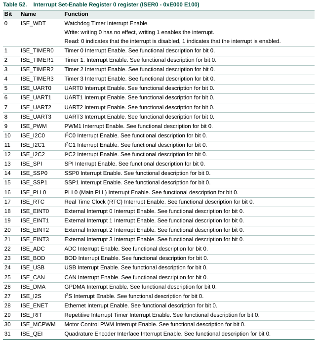

#   ADC lpc1769 Ejemplo
Proyecto ejemplo para controlar el Conversor Analógico Digital (ADC o CAD) integrado el micro controlador LPCXpresso lpc1769.
El ejemplo realiza la lectura tensión de la pata variable de un potensiometro conectado entre 3,3V y GND.

- IDE: [MCUXpresso IDE](https://www.nxp.com/design/software/development-software/mcuxpresso-software-and-tools-/mcuxpresso-integrated-development-environment-ide:MCUXpresso-IDE).
- Lenguaje: C.
- Microcontrolador: [LPCXpresso lpc1769 rev C](https://www.embeddedartists.com/products/lpc1769-lpcxpresso/).
- ADC 12 bit integrado en el microcontrolador

---
## LPCXpresso LPC1769
 

### PCONP

### PCLKSELx

### ISER0

### ADC - REGISTROS

---
Espero le sea de útilidad.

Aportes y sugerencias siempre serán bienvenidas.

Autor: @ealegremendoza

E-mail: ealegremendoza@gmail.com
